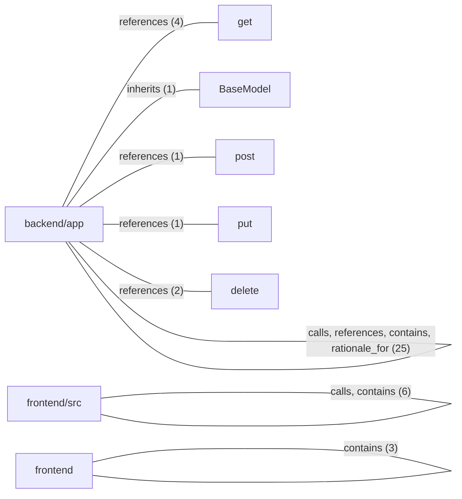

# DreamMagnet/codex_pro Architecture

Repository: DreamMagnet/codex_pro
Branch: main
Viewed commit: 78fa198ee9ba97b350c930e0568fabd958637f58
Graph commit: 78fa198ee9ba97b350c930e0568fabd958637f58
Snapshot status: current

## Project Context

Created with CodeAtlas

Source graph: graphify-out/graph.json
Source graph SHA-256: 47064d795a1ce27f3fcc9e20b5b7107027d403246a8ea88ba3d4e4a04e47e08b
Inventory: 8 modules, 4 files, 30 symbols, 43 connections.

## Module Connections

## Module Inventory

| Module | Source files | Symbols |
| --- | --- | --- |
| backend/app | backend/app/__init__.py, backend/app/main.py | 15 |
| frontend/src | frontend/src/main.js | 6 |
| get | Not recorded | 1 |
| BaseModel | Not recorded | 1 |
| post | Not recorded | 1 |
| put | Not recorded | 1 |
| delete | Not recorded | 1 |
| frontend | frontend/package.json | 4 |

## Symbol Inventory

| ID | Symbol | Kind | Source file | Source location | Description |
| --- | --- | --- | --- | --- | --- |
| backend_app_main_item | Item | symbol | backend/app/main.py | L24 |  |
| backend_app_main_count_items | count_items() | symbol | backend/app/main.py | L52 |  |
| backend_app_main_get_item | get_item() | symbol | backend/app/main.py | L57 |  |
| backend_app_main_health_check | health_check() | symbol | backend/app/main.py | L42 |  |
| backend_app_main_list_items | list_items() | symbol | backend/app/main.py | L47 |  |
| backend_app_main_main | main() | symbol | backend/app/main.py | L100 |  |
| backend_app_main_read_items | read_items() | symbol | backend/app/main.py | L29 |  |
| backend_app_main_create_item | create_item() | symbol | backend/app/main.py | L65 |  |
| backend_app_main_update_item | update_item() | symbol | backend/app/main.py | L74 |  |
| frontend_src_main_deleteitem | deleteItem() | symbol | frontend/src/main.js | L23 |  |
| frontend_src_main_loaditems | loadItems() | symbol | frontend/src/main.js | L7 |  |
| backend_app_main_delete_all_items | delete_all_items() | symbol | backend/app/main.py | L95 |  |
| backend_app_main_delete_item | delete_item() | symbol | backend/app/main.py | L85 |  |
| backend_app_main_write_items | write_items() | symbol | backend/app/main.py | L36 |  |
| backend_app_main | main.py | symbol | backend/app/main.py | L1 |  |
| get | get | symbol |  |  |  |
| backend_app_main_rationale_1 | Simple FastAPI backend that stores items in a JSON file (no database). | symbol | backend/app/main.py | L1 |  |
| basemodel | BaseModel | symbol |  |  |  |
| post | post | symbol |  |  |  |
| put | put | symbol |  |  |  |
| frontend_src_main | main.js | symbol | frontend/src/main.js | L1 |  |
| frontend_src_main_form | form | symbol | frontend/src/main.js | L3 |  |
| frontend_src_main_input | input | symbol | frontend/src/main.js | L4 |  |
| frontend_src_main_list | list | symbol | frontend/src/main.js | L5 |  |
| delete | delete | symbol |  |  |  |
| frontend_package | package.json | symbol | frontend/package.json | L1 |  |
| frontend_package_name | name | symbol | frontend/package.json | L2 |  |
| frontend_package_private | private | symbol | frontend/package.json | L4 |  |
| frontend_package_version | version | symbol | frontend/package.json | L3 |  |
| backend_app_init | __init__.py | symbol | backend/app/__init__.py | L1 |  |

## Recorded Connections

| Source ID | Source file | Relationship | Target ID | Target file |
| --- | --- | --- | --- | --- |
| backend_app_main_count_items | backend/app/main.py | calls | backend_app_main_read_items | backend/app/main.py |
| backend_app_main_create_item | backend/app/main.py | calls | backend_app_main_read_items | backend/app/main.py |
| backend_app_main_create_item | backend/app/main.py | calls | backend_app_main_write_items | backend/app/main.py |
| backend_app_main_delete_all_items | backend/app/main.py | calls | backend_app_main_write_items | backend/app/main.py |
| backend_app_main_delete_item | backend/app/main.py | calls | backend_app_main_read_items | backend/app/main.py |
| backend_app_main_delete_item | backend/app/main.py | calls | backend_app_main_write_items | backend/app/main.py |
| backend_app_main_get_item | backend/app/main.py | calls | backend_app_main_read_items | backend/app/main.py |
| backend_app_main_list_items | backend/app/main.py | calls | backend_app_main_read_items | backend/app/main.py |
| backend_app_main_update_item | backend/app/main.py | calls | backend_app_main_read_items | backend/app/main.py |
| backend_app_main_update_item | backend/app/main.py | calls | backend_app_main_write_items | backend/app/main.py |
| frontend_src_main_deleteitem | frontend/src/main.js | calls | frontend_src_main_loaditems | frontend/src/main.js |
| backend_app_main_count_items | backend/app/main.py | references | get |  |
| backend_app_main_create_item | backend/app/main.py | references | post |  |
| backend_app_main_delete_all_items | backend/app/main.py | references | delete |  |
| backend_app_main_delete_item | backend/app/main.py | references | delete |  |
| backend_app_main_get_item | backend/app/main.py | references | get |  |
| backend_app_main_health_check | backend/app/main.py | references | get |  |
| backend_app_main_list_items | backend/app/main.py | references | get |  |
| backend_app_main_update_item | backend/app/main.py | references | put |  |
| backend_app_main_create_item | backend/app/main.py | references | backend_app_main_item | backend/app/main.py |
| backend_app_main_update_item | backend/app/main.py | references | backend_app_main_item | backend/app/main.py |
| backend_app_main | backend/app/main.py | contains | backend_app_main_main | backend/app/main.py |
| backend_app_main | backend/app/main.py | contains | backend_app_main_item | backend/app/main.py |
| backend_app_main | backend/app/main.py | contains | backend_app_main_read_items | backend/app/main.py |
| backend_app_main | backend/app/main.py | contains | backend_app_main_write_items | backend/app/main.py |
| backend_app_main | backend/app/main.py | contains | backend_app_main_health_check | backend/app/main.py |
| backend_app_main | backend/app/main.py | contains | backend_app_main_list_items | backend/app/main.py |
| backend_app_main | backend/app/main.py | contains | backend_app_main_count_items | backend/app/main.py |
| backend_app_main | backend/app/main.py | contains | backend_app_main_get_item | backend/app/main.py |
| backend_app_main | backend/app/main.py | contains | backend_app_main_create_item | backend/app/main.py |
| backend_app_main | backend/app/main.py | contains | backend_app_main_update_item | backend/app/main.py |
| backend_app_main | backend/app/main.py | contains | backend_app_main_delete_item | backend/app/main.py |
| backend_app_main | backend/app/main.py | contains | backend_app_main_delete_all_items | backend/app/main.py |
| frontend_package | frontend/package.json | contains | frontend_package_name | frontend/package.json |
| frontend_package | frontend/package.json | contains | frontend_package_version | frontend/package.json |
| frontend_package | frontend/package.json | contains | frontend_package_private | frontend/package.json |
| frontend_src_main | frontend/src/main.js | contains | frontend_src_main_deleteitem | frontend/src/main.js |
| frontend_src_main | frontend/src/main.js | contains | frontend_src_main_form | frontend/src/main.js |
| frontend_src_main | frontend/src/main.js | contains | frontend_src_main_input | frontend/src/main.js |
| frontend_src_main | frontend/src/main.js | contains | frontend_src_main_list | frontend/src/main.js |
| frontend_src_main | frontend/src/main.js | contains | frontend_src_main_loaditems | frontend/src/main.js |
| backend_app_main_item | backend/app/main.py | inherits | basemodel |  |
| backend_app_main_rationale_1 | backend/app/main.py | rationale_for | backend_app_main | backend/app/main.py |

## Repository Documentation

### README.md

# codex_pro

Scaffolded by CodeAtlas as a both project.ccc
 varghese

 chnages addedd
 user can see

### graphify-out/GRAPH_REPORT.md

# Graph Report - codex_pro  (2026-09-14)

## Corpus Check
- cluster-only mode — file stats not available

## Summary
- 30 nodes · 43 edges · 6 communities
- Extraction: 100% EXTRACTED · 0% INFERRED · 0% AMBIGUOUS
- Token cost: 0 input · 0 output

## Graph Freshness
- Built from commit: `67f3d736`
- Run `git rev-parse HEAD` and compare to check if the graph is stale.
- Run `graphify update .` after code changes (no API cost).

## Community Hubs (Navigation)
- Community 0
- Community 1
- Community 2
- Community 3
- Community 4

## God Nodes (most connected - your core abstractions)
1. `read_items()` - 7 edges
2. `create_item()` - 5 edges
3. `update_item()` - 5 edges
4. `write_items()` - 5 edges
5. `Item` - 4 edges
6. `delete_item()` - 4 edges
7. `count_items()` - 3 edges
8. `get_item()` - 3 edges
9. `list_items()` - 3 edges
10. `delete_all_items()` - 3 edges

## Surprising Connections (you probably didn't know these)
- `create_item()` --calls--> `read_items()`  [EXTRACTED]
  backend/app/main.py → backend/app/main.py  _Bridges community 0 → community 1_
- `delete_item()` --calls--> `read_items()`  [EXTRACTED]
  backend/app/main.py → backend/app/main.py  _Bridges community 0 → community 3_
- `create_item()` --calls--> `write_items()`  [EXTRACTED]
  backend/app/main.py → backend/app/main.py  _Bridges community 1 → community 3_

## Import Cycles
- None detected.

## Communities (6 total, 0 thin omitted)

### Community 0 - "Community 0"
Cohesion: 0.39
Nodes (7): count_items(), get_item(), health_check(), list_items(), Simple FastAPI backend that stores items in a JSON file (no database)., read_items(), get

### Community 1 - "Community 1"
Cohesion: 0.33
Nodes (6): create_item(), Item, update_item(), BaseModel, post, put

### Community 2 - "Community 2"
Cohesion: 0.40
Nodes (5): deleteItem(), form, input, list, loadItems()

### Community 3 - "Community 3"
Cohesion: 0.67
Nodes (4): delete_all_items(), delete_item(), write_items(), delete

### Community 4 - "Community 4"
Cohesion: 0.50
Nodes (3): name, private, version

## Knowledge Gaps
- **6 isolated node(s):** `form`, `input`, `list`, `name`, `private` (+1 more)
  These have ≤1 connection - possible missing edges or undocumented components. (Counts symbols only; 12 node(s) total have ≤1 connection when file, concept and rationale nodes are included.)

## Suggested Questions
_Questions this graph is uniquely positioned to answer:_

- **Why does `create_item()` connect `Community 1` to `Community 0`, `Community 3`?**
  _High betweenness centrality (0.046) - this node is a cross-community bridge._
- **Why does `update_item()` connect `Community 1` to `Community 0`, `Community 3`?**
  _High betweenness centrality (0.046) - this node is a cross-community bridge._
- **Why does `Item` connect `Community 1` to `Community 0`?**
  _High betweenness centrality (0.044) - this node is a cross-community bridge._
- **What connects `form`, `input`, `list` to the rest of the system?**
  _6 weakly-connected nodes found - possible documentation gaps or missing edges._

## Evidence and Coverage

Module boundaries are source folders, not inferred deployment boundaries. The diagram preserves recorded graph connections; it does not establish runtime behavior.
Connection direction is not verified by the source graph.
- This snapshot does not declare directed edges; connection direction is not verified.
- Coverage is limited to the committed graph and documents. Undocumented runtime services and connections are not inferred.

Repository documents are source material. Validate architecture claims against the source files at the viewed commit.
